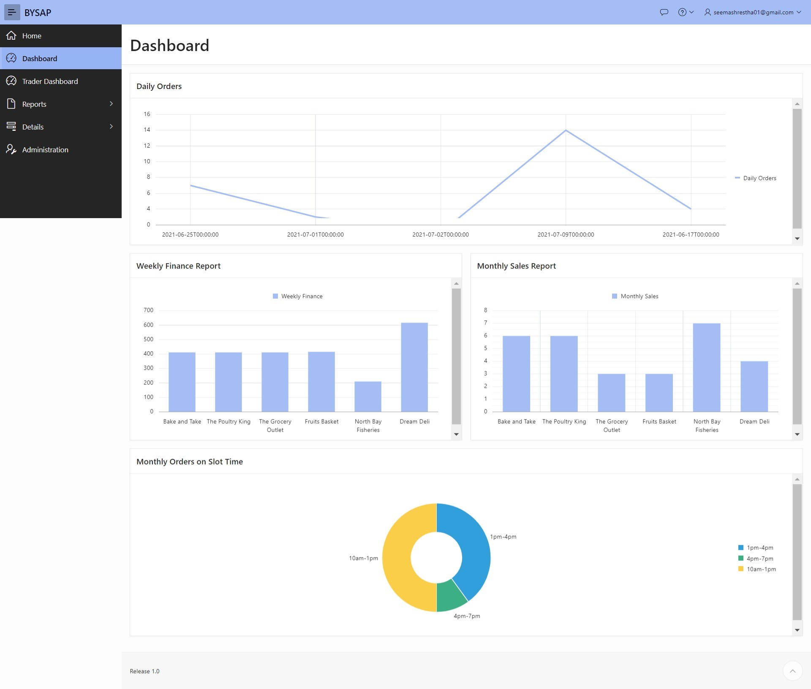

# Bysap
## Description
The project Bysap utilizes XAMPP stack to create a prototype for merchant-client e-commerce website. It is a comprehensive client-server solution which accomodates users with 3 different roles: client, merchant and admin.

## Prerequisites

1. Oracle 19c and php oci extension.
2. Xampp 7.2.3

## Project Breakdown
### Entity Relationship Diagram
The following diagram shows the entity and their relations for the system that has been built. It is reflected in the database design of the system.

*fig - Entity Relationship Diagram*

### Implementation

#### Apex Application
The apex application the purpose of providing an admin a platform manage the merchants to ensure that the rules of the platform is enforced.

Furthermore, it also allows merchant access to statistics of their shop.

*fig - Merchant Dashboard with report*

*fig - Comment review for admins*

#### Website
The website allows both the client users and the merchant users access to different UI to either manage the purchase or manage the products respectively.

*fig - Product selection Page*

*fig - Merchant product CRUD*

## Getting Started

### Apex Oracle Application
1. Install Oracle Database 19c and Oracle Instant Client.
2. Setup the Oracle Database admin.
3. Login to the Oracle Application Express using the credentials created.
4. Import the required script files using the GUI interface and run them.

Following these steps should setup the database reqiured by the PHP and the Oracle application and also set up the Oracle application as well.

### XAMPP Setup
1. Setup XAMPP.
2. Enable Oracle extension in PHP by modifying php.ini file.
3. Setup the folder structure in htdocs directory of XAMPP.
4. Copy the code found here to the created folder.
5. The project also requires you to set up sendmail which is used for password recovery.
6. Paypal developer account must also be created and specific ammendments must be done to integrate this feature with a particular developer account.

